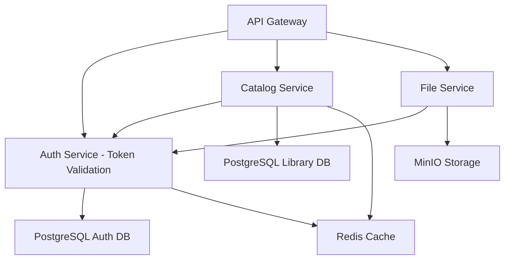

# Library Management System - Microservices Architecture

## 📋 Overview
Dự án thư viện được thiết kế theo mô hình microservices với 3 services chính và các supporting services.

## 🏗️ Architecture Diagram

```
┌─────────────────┐    ┌─────────────────┐    ┌─────────────────┐
│   API Gateway   │────│   Load Balancer │────│     Client      │
│   (Port 8080)   │    │                 │    │   (Frontend)    │
└─────────────────┘    └─────────────────┘    └─────────────────┘
         │
         ├─────────────────────────────────────────────┐
         │                         │                   │
┌─────────────────┐    ┌─────────────────┐    ┌─────────────────┐
│ Authentication  │    │ Book Catalog    │    │ File Storage    │
│    Service      │    │    Service      │    │    Service      │
│  (Port 8081)    │    │  (Port 8082)    │    │  (Port 8083)    │
└─────────────────┘    └─────────────────┘    └─────────────────┘
         │                         │                   │
         │                         │                   │
┌─────────────────┐    ┌─────────────────┐    ┌─────────────────┐
│ PostgreSQL DB   │    │ PostgreSQL DB   │    │    MinIO        │
│ (Auth Schema)   │    │(Library Schema) │    │   Storage       │
└─────────────────┘    └─────────────────┘    └─────────────────┘
         │                         │                   │
         └─────────────────────────┼───────────────────┘
                                   │
                          ┌─────────────────┐
                          │     Redis       │
                          │  (Shared Cache) │
                          └─────────────────┘
```

## 🚀 Services Overview

### 1. **Authentication Service** (Port 8081)
- **Responsibility**: User authentication, authorization, JWT token management
- **Database**: PostgreSQL (auth schema)
- **Key Features**:
  - User registration/login
  - JWT token generation/validation
  - Role-based access control
  - Password management
  - OTP verification

### 2. **Book Catalog Service** (Port 8082) 
- **Responsibility**: Book management, categories, authors, publishers, e-commerce
- **Database**: PostgreSQL (library schema)
- **Key Features**:
  - Book CRUD operations
  - Category/Author/Publisher management
  - Advanced search and filtering
  - Book availability tracking
  - Shopping cart management
  - Order processing and management
  - VNPay payment integration
  - Order tracking and history

### 3. **File Storage Service** (Port 8083)
- **Responsibility**: File upload, storage, and retrieval
- **Storage**: MinIO object storage
- **Key Features**:
  - Image/document upload
  - File metadata management
  - Secure file access
  - File versioning

### 4. **API Gateway** (Port 8080) - *To be implemented*
- **Responsibility**: Route requests, authentication proxy, load balancing
- **Key Features**:
  - Request routing
  - Authentication verification
  - Rate limiting
  - CORS handling

## 📂 Project Structure

```
Library-Project/
├── api-gateway/                    # API Gateway service
├── authentication-service/         # Renamed from AuthenService
├── book-catalog-service/          # Renamed from library-backend  
├── file-storage-service/          # Renamed from MinIOService
├── shared-library/                # Common DTOs, utilities
├── docker-compose.yml             # All services orchestration
├── kubernetes/                    # K8s deployment files
│   ├── auth-service.yaml
│   ├── catalog-service.yaml
│   ├── file-service.yaml
│   └── gateway-service.yaml
└── docs/                          # Documentation
    ├── api-documentation.md
    ├── deployment-guide.md
    └── development-setup.md
```

## 🔧 Service Configuration

### Communication Patterns
- **Synchronous**: REST APIs via API Gateway
- **Asynchronous**: Message queues (RabbitMQ/Kafka) for future implementation
- **Service Discovery**: Spring Cloud Eureka (future)

### Data Management
- **Database per Service**: Each service owns its data
- **Shared Cache**: Redis for session management and caching
- **Event Sourcing**: For audit trails (future)

### Security
- **JWT Tokens**: Issued by Authentication Service
- **Service-to-Service**: Internal API keys or mTLS
- **Gateway Security**: Rate limiting, IP filtering

## 🐳 Deployment Strategy

### Docker Composition
```yaml
services:
  api-gateway:
    ports: ["8080:8080"]
  auth-service:
    ports: ["8081:8081"]
  catalog-service:
    ports: ["8082:8082"]
  file-service:
    ports: ["8083:8083"]
  postgres-auth:
    ports: ["5433:5432"]
  postgres-library:
    ports: ["5434:5432"]
  redis:
    ports: ["6379:6379"]
  minio:
    ports: ["9000:9000", "9001:9001"]
```

### Environment Configuration
- **Development**: Docker Compose
- **Staging**: Kubernetes cluster
- **Production**: Cloud deployment (AWS/GCP/Azure)

## 📊 Service Dependencies



## 🔄 Migration Plan

### Phase 1: Service Renaming & Standardization
1. Rename services for consistency
2. Standardize port configurations
3. Update package structures

### Phase 2: API Gateway Implementation
1. Create Spring Cloud Gateway
2. Implement authentication proxy
3. Add rate limiting and CORS

### Phase 3: Service Communication
1. Implement service-to-service authentication
2. Add circuit breakers (Hystrix/Resilience4j)
3. Implement health checks

### Phase 4: Shared Library
1. Extract common DTOs
2. Create shared utilities
3. Implement common exception handling

### Phase 5: Payment Integration (VNPay)
1. Implement VNPay payment gateway in Book Catalog Service
2. Add payment processing workflows
3. Implement webhook handlers for payment callbacks
4. Add payment status tracking and reconciliation

### Phase 6: Monitoring & Observability
1. Add distributed tracing (Sleuth/Zipkin)
2. Implement centralized logging (ELK stack)
3. Add metrics collection (Prometheus/Grafana)
4. Monitor payment success rates and failures

## 🚦 Next Steps

1. **Immediate**: Implement VNPay payment integration
2. **Short-term**: Complete API Gateway implementation
3. **Medium-term**: Add service discovery and load balancing
4. **Long-term**: Implement comprehensive monitoring and observability

## 📋 Benefits of This Architecture

✅ **Scalability**: Each service can scale independently  
✅ **Maintainability**: Clear separation of concerns  
✅ **Technology Diversity**: Different services can use different tech stacks  
✅ **Fault Isolation**: Failure in one service doesn't affect others  
✅ **Team Independence**: Teams can work on services independently  
✅ **Deployment Flexibility**: Deploy services independently  

## ⚠️ Challenges to Address

- **Distributed System Complexity**: Need proper monitoring and debugging tools
- **Data Consistency**: Implement eventual consistency patterns
- **Network Latency**: Optimize service-to-service communication
- **Testing Complexity**: Need integration and contract testing
- **Operational Overhead**: Requires DevOps expertise